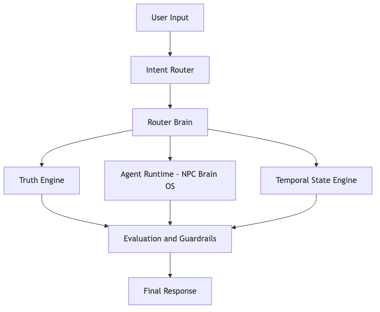

# Odyssey AI Platform


Odyssey is a **systems-level applied AI platform** that routes user input into distinct reasoning pipelines — **truth retrieval**, **stateful agent behavior**, and **time-aware timeline progression**.  
It demonstrates how to build agentic systems that are **modular**, **constrained**, and **explainable**: separating facts from speculation, enforcing behavioral boundaries via routing, and maintaining continuity through temporal state.  
This repo is a curated, runnable reference implementation designed for **applied AI / agent systems interviews**.



## Core Architecture

- **Intent Routing Engine** (`backend/app/intent_router.py`, `backend/app/router_brain.py`)
  - Routes user input to the appropriate intelligence path (facts, agent dialogue, temporal reasoning, constrained speculation)

- **Truth & Knowledge Engine** (`backend/app/truth_engine/`)
  - Separates canonical facts from inferred or speculative content
  - Supports confidence-aware retrieval

- **Agent Runtime (NPC Brain OS)** (`backend/app/npc/`)
  - Stateful agents with role constraints, scoped memory, and reaction logic

- **Temporal State Engine** (`backend/app/timeline/`)
  - Event-driven timeline progression, state transitions, and time-aware behavior gating

- **Evaluation & Guardrails**
  - Treated as a first-class concern via routing constraints, epistemic labeling, and temporal gating

## Case Studies

- **Case Study #1: Epistemic Control & Hallucination Prevention** — [Read](case-studies/case-study-1-epistemic-control.md)
- **Case Study #2: Temporal Reasoning & Stateful Intelligence** — [Read](case-studies/case-study-2-temporal-state.md)

User Input
   |
   v
Intent Router  --->  Router Brain
                      |     |      |
                      v     v      v
                 Truth   NPC OS   Timeline
                 Engine  Runtime  Engine
                      \     |      /
                       v    v     v
                   Response Assembly
                          |
                          v
                     Final Response


## Quickstart (Local)

### 1) Setup
```bash
cd odyssey-ai-platform
python -m venv .venv
source .venv/bin/activate
pip install -r requirements.txt
cp .env.example .env

Once running, open:

👉 **[http://127.0.0.1:8000](http://127.0.0.1:8000)**

